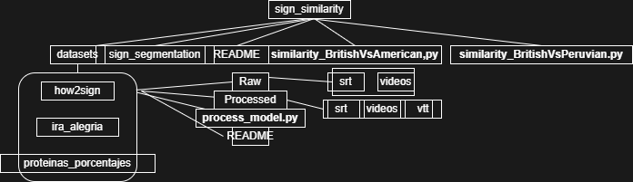
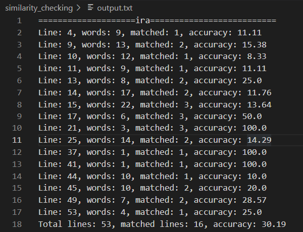
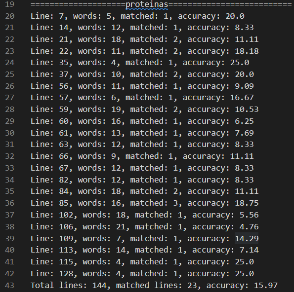
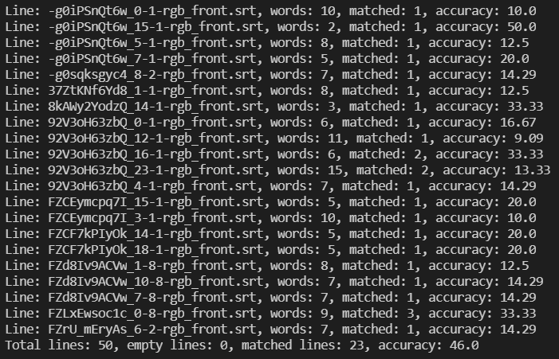

# Similarity checking of sign languages

This repository checks for similarity between 
1) British sign language and Peruvian sign language 
2) British sign language and American sign language

with the "Temporal segmentation of sign language videos" [model](https://github.com/tonnidas/sign-segmentation) that is pre-trained in British sign language (BSL).

## Contents

## Setups
All set up instructions for "Temporal segmentation of sign language videos" can be found [here](https://github.com/tonnidas/sign-segmentation). The other pre-processing models are python files. 

## Data & Models/algorithms
The main datasets, processed datasets and all their pre-processing models are in the folder named `dataset`. Inside the dataset folder, for Peruvian sign language there are two datasets: `datasets/ira_alegira` & `datasets/proteinas_porcentajes` and for American sign language, there is one dataset: `datasets/how2sign`.

### Data
- `ira_alegria:` 
    1. `processed ira_alegria`: It has `srt`, `videos`, `vtt` folders holding the input segmented signs, input videos, output segmented signs accordingly. 
    2. `raw ira_alegria`: It has `srt`, `videos` folders holding the signs with temporal boundaries, input videos accordingly.
    3. `process_ira.py:` This is the model we implemented to process the raw  dataset.

- `proteinas_porcentajes:` 
    1. `processed proteinas_porcentajes`: It has `srt`, `videos`, `vtt` folders holding the input segmented signs, input videos, output segmented signs accordingly. 
    2. `raw proteinas_porcentajes`: It has `srt`, `videos` folders holding the signs with temporal boundaries, input videos accordingly.
    3. `process_proteinas.py:` This is the model we implemented to process the raw  dataset.
- `how2sign:` 
    1. `processed how2sign`: It has `srt`, `videos`, `vtt` folders holding the input segmented signs, input videos, output segmented signs accordingly. 
    2. `raw how2sign`: It has `srt`, `videos` folders holding the signs with temporal boundaries, input videos accordingly.
    3. `process_how2sign.py:` This is the model we implemented to process the raw  dataset.

### Models
The models for pre-processing the datasets are attached in the `datasets folder`. 

## Results
- **British sign language and Peruvian sign language**: We processed two datasets namely ira_alegria and proteinas_porcentajes. We identified in how many files/lines, there is at-least one match. The input files are the srt files we processed from ira_alegria and proteinas_porcentajes datasets and the output files are the vtt files that we collected by running corresponding video files of these srt files in the "Temporal segmentation of sign language videos" [model](https://github.com/tonnidas/sign-segmentation). These input srt files and output vtt files has a number of words for signs in that line/sentence/video file. Than we identified for how many input files, there is at-least one word match in the output file. For ira_alegria and proteinas_porcentajes, we found approximately **30%** and **16%**.

 

- **British sign language and American sign language**: We processed one dataset namely [how2sign](https://how2sign.github.io/#download). We identified in how many files/lines, there is at-least one matched word. The input files are the srt files we processed from the csv translation file in the dataset and the output files are the vtt files that we collected by running corresponding video files of these srt files in the "Temporal segmentation of sign language videos" [model](https://github.com/tonnidas/sign-segmentation). These input srt files and output vtt files has a number of words for signs in that line/sentence/video file. Than we identified for how many input files, there is at-least one word match in the output file. For how2sign, we found approximately **46%**.

